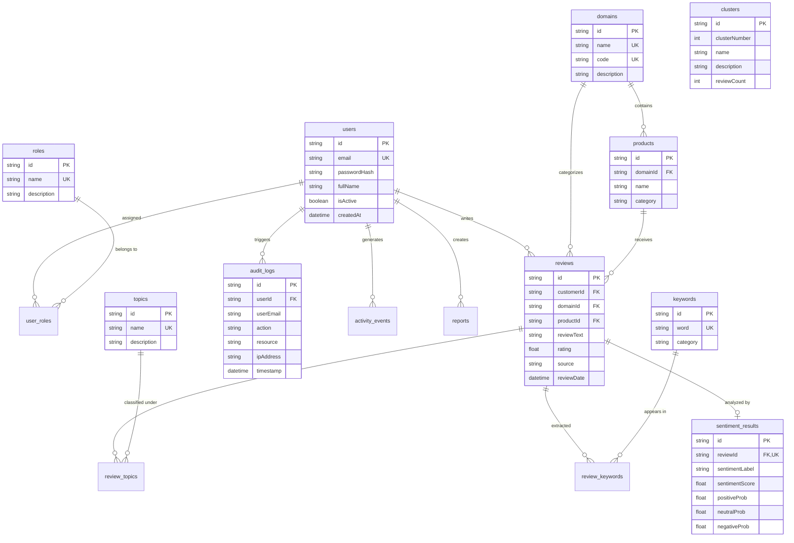

# Entity-Relationship (ER) Diagram

## Smart Review Analytics Platform Database Architecture

This document presents the complete Entity-Relationship diagram for the 3-Tier Enterprise Database design (PostgreSQL / SQLite via Prisma ORM), satisfying **Enterprise Systems (ES) Unit I (DBMS & 3-Tier Architecture)** and **ITPM Unit VI (Database Management)** requirements.

---

## Entity Summaries & Subject Mapping

| Entity Table | ES Subject Mapping | ASTMA Subject Mapping | Core Functionality |
| :--- | :--- | :--- | :--- |
| `users` | Unit III (CRM & User Directory) | - | Manages authenticated platform users |
| `roles` / `user_roles` | Unit III (RBAC & Access Control) | - | Defines granular roles (`Admin`, `Analyst`, `BusinessUser`, `Customer`) |
| `domains` / `products` | Unit I & II (ERP Enterprise Modules) | - | Categorizes reviews across 5 domains (Hotels, Restaurants, Movies, Electronics, E-commerce) |
| `reviews` | Unit I (Data Layer) | Unit I (Text Mining Source) | Stores raw review text, ratings, and timestamps |
| `sentiment_results` | - | Unit II (Sentiment Prediction) | Stores output label (`Positive`, `Neutral`, `Negative`) & compound scores |
| `keywords` / `review_keywords` | - | Unit III (Keyword Extraction) | Stores candidate keywords and TF-IDF / frequency scores |
| `topics` / `review_topics` | - | Unit II (Topic Detection) | Maps reviews to domain topics with probabilities |
| `clusters` | - | Unit I & II (Unsupervised Clustering) | Groups reviews via K-Means / text feature clustering |
| `audit_logs` | Unit III (Audit Trails & Security) | - | Enterprise security logging for system actions |
| `activity_events` | - | Unit IV (Web Analytics & Activity) | Tracks search activity and clickstream events |
